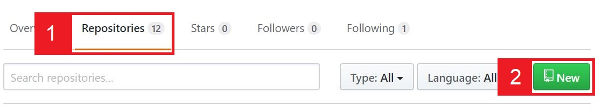
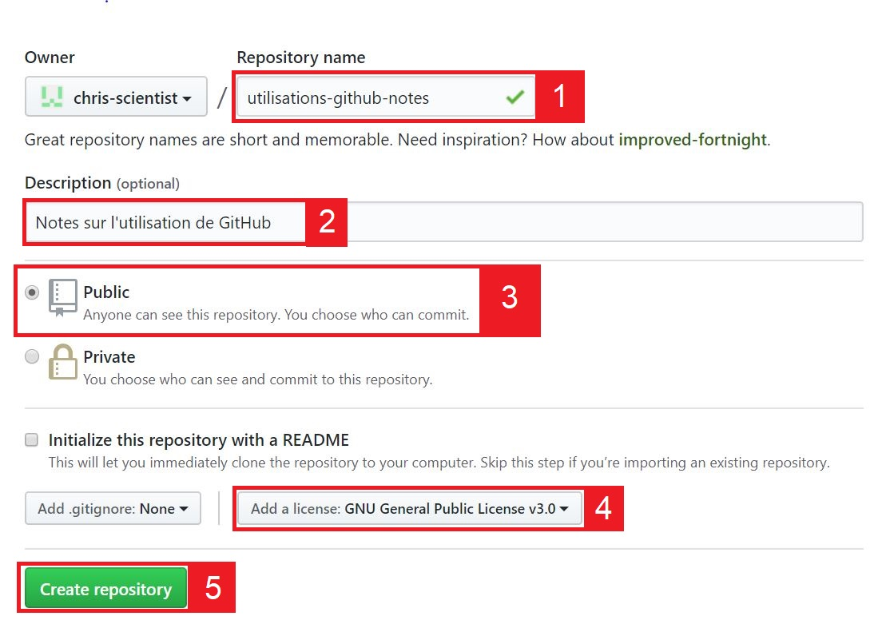
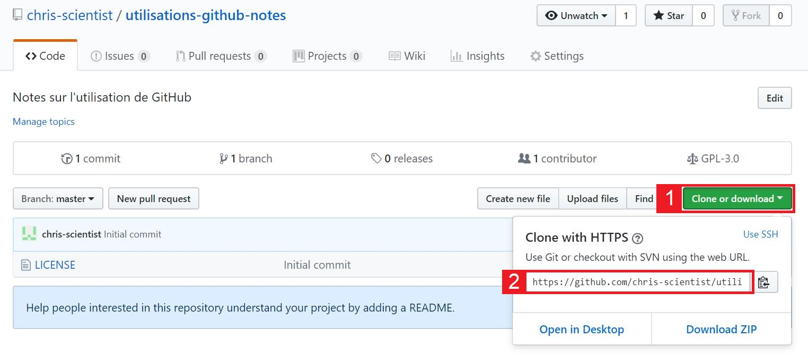
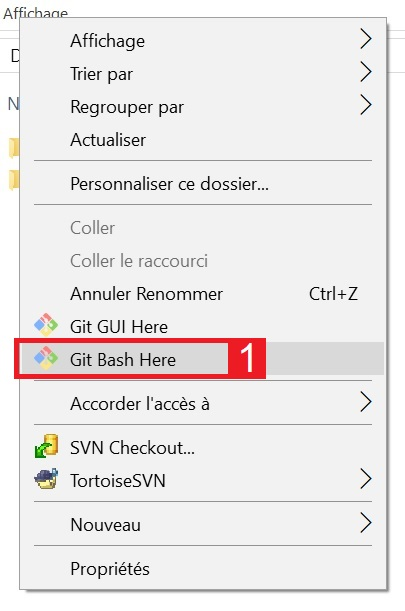
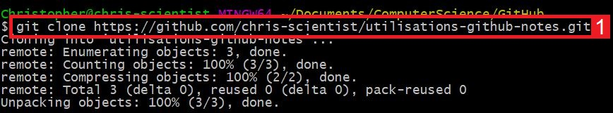
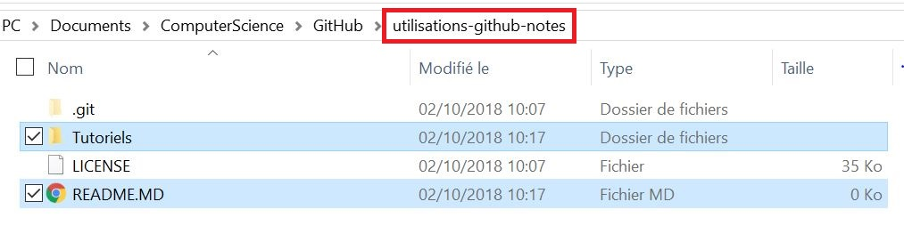
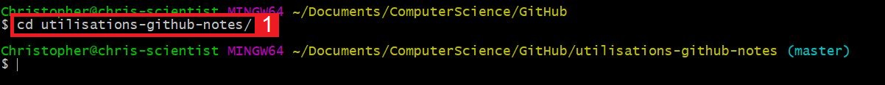
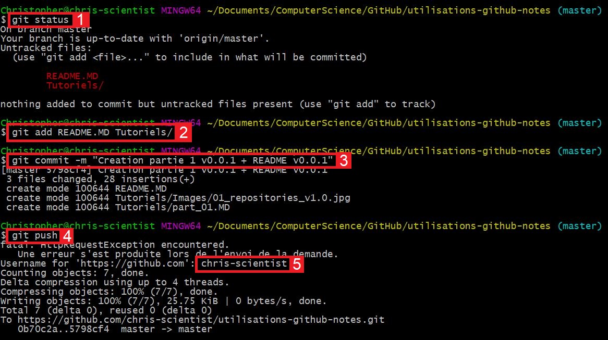
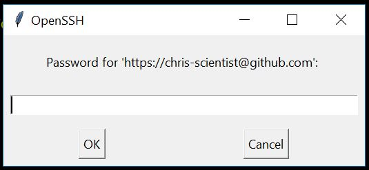

# Partagez votre projet sur GitHub

v0.1.2

## INTRODUCTION

Ce tutoriel a pour objectif d'expliquer **comment partager son projet sur GitHub**. Evidement il existe d'autres plateformes pour partager un projet, pour n'en citez qu'une on peut évoquer GitLab, mais ce tutoriel explique comment partager via GitHub.

Pré-requis :
* Être sous **Windows** (1)

[1] J'expliquerai ultérieurement comment faire sur Linux, mais sachez que seul le client diffère. Pour les produits Apple je ne pourrai pas vous guider car je n'en ai pas sous la main - pensez à moi pour Noël...

## CRÉATION DU REPOSITORY

Le repository ? Il s'agit d'un répertoire avec des méta-données qui vous permet de faire le lien entre votre ordinateur et GitHub. En français, on parle de dépôt.

Nous allons voir ici comment créer un repository sur GitHub.

1. Rendez-vous sur votre compte GitHub (après authentification)
2. Allez dans (1) **Repositories**, puis (2) **New** (comme le montre la capture ci-dessous)

3. Sur la page suivante complétez les informations suivantes (comme le montre la capture ci-dessous) :

* (1) Donnez un nom à votre repository.
* (2) Ajoutez une brève description (facultatif).
* (3) Choisissez la visibilité de votre repository : public est la meilleure option si vous souhaitez partager votre projet avec le monde entier.
* (4) Choisissez la licence de votre projet : ici GPL v3.0 (plus de détails un peu plus loin).
* (5) Enfin, validez la création du repository.

### Quelle licence choisir ?

Je ne vais pas vous présenter l'ensemble des licences car il en existe de nombreuse.

Sachez simplement que la GPL v3.0 :
* Autorise une utilisation commerciale de votre projet.
* Autorise les modification de votre projet (en dehors de votre repository).
* Autorise la distribution de votre projet.
* Etc.

## GESTION DES SOURCES

Pour parler avec les serveurs GitHub : récupérer votre repository en local, envoyer vos fichiers sur GitHub, etc ; nous avons besoin pour cela d'un client Git. Il en existe une multitude et j'ai fais le choix d'utiliser git bash (je parle ici d'un client Windows), vous pouvez [télécharger git bash](https://gitforwindows.org/) en suivant le lien et l'installer.

### Récupérer le repository

Dans un premier temps, il vous faut récupérer votre repository sur votre machine, cette étape est à faire une fois à l'initialisation de votre projet.

Dans ce but copiez l'adresse du repository en suivant les étapes indiquées sur la capture ci-dessous :

Dans votre explorateur de fichiers ouvrez git bash via un clic droit (comme le montre la capture ci-dessous) :

Enfin récupérer votre repository en écrivant **git clone adresse-du-repository** :

### Envoyez vos fichiers et répertoires sur GitHub

Dans un second temps, voyons comment envoyer ses fichiers et ses répertoires sur GitHub, cette étape est a répété autant de fois que nécessaire. Exemple d'application : 
* Vous créer la v1.0 de votre projet.
* **Envoyez la sur GitHub, ceci en suivant cette étape**.
* Vous apportez une modification à votre projet qui est alors en v1.1.
* **Envoyez la v1.1 sur GitHub, ceci en suivant cette étape**.

Dans le répertoire que vous venez de récupérer, ajoutez votre projet autrement dit ajoutez votre contenu, ici : j'ai un répertoire nommé *Tutoriels* et un fichier *README.MD*.

Retournez dans git bash, déplacez vous dans le repository via **cd nom-du-repository** (cd signifie "change directory" autrement dit "changer de répertoire") :

Pour envoyer vos fichiers/répertoires sur GitHub il faut suivre plusieurs étapes :
* **git status** : permet de visualiser quel est l'état du repository.
* **git add fichiers repertoires** : permet d'indiquer que ces fichiers/répertoires doivent être ajouter au repository.
* **git commit -m "Un commentaire"** : permet de valider le ou les *git add* effectué avant.
* **git push** : permet d'envoyer vos commits en attentes sur GitHub (demande votre login dans la console puis votre mot de passe dans une fenêtre, voir captures).

Vous pouvez faire un *git status* après chacune des étapes.

Voici à quoi ressemble la fenêtre demandant votre mot de passe :

Petite astuce : si vous voulez ajouter tous les fichiers en attente vous pouvez tapez **git add .**.

**Revenons sur le fichier README.MD**

Il s'agit d'un fichier qu'il est conseillé d'ajouter, en effet ce fichier est sensé décrire votre projet. La syntaxe de ce fichier est en MarkDown.

## CONCLUSION

Vous avez désormais le kit de survie pour partager vos projets sur GitHub via git bash (pour Windows).
