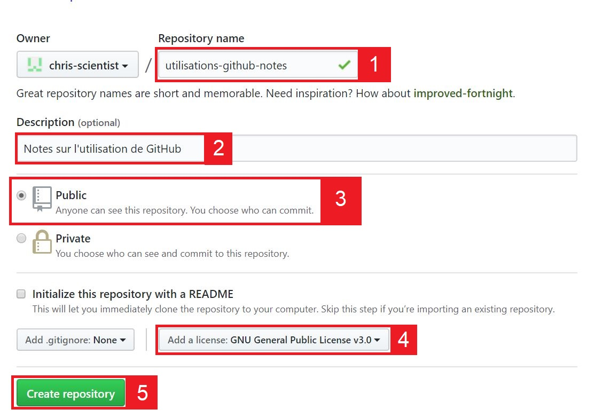
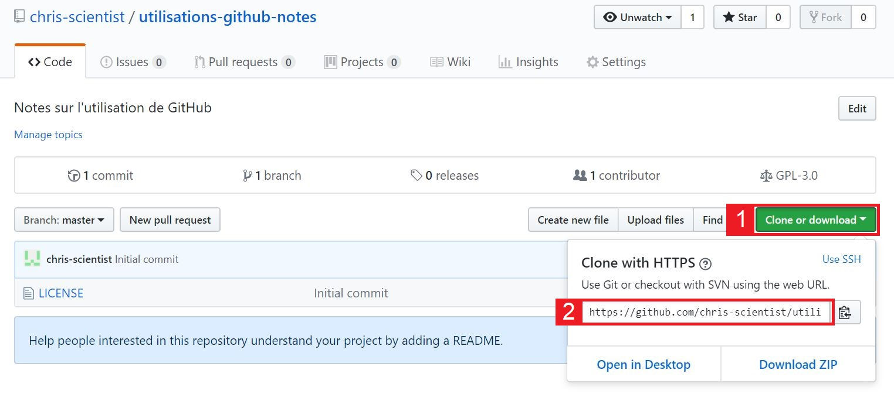
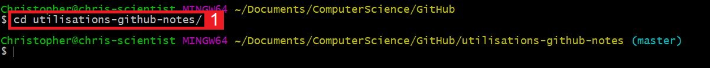
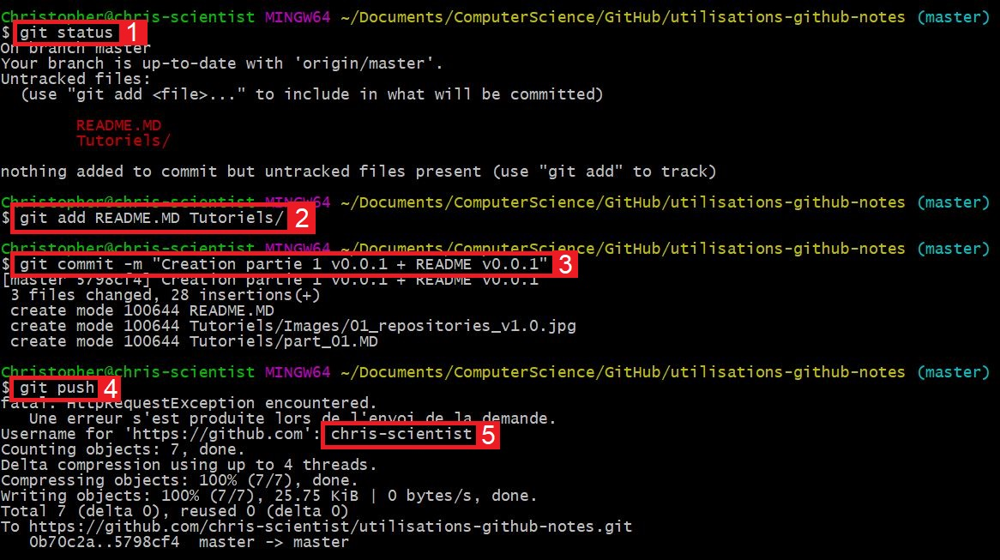
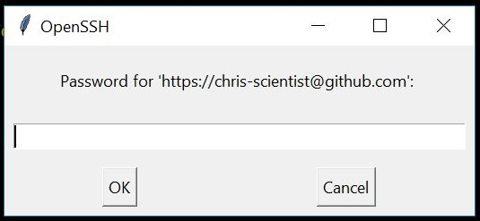

# Share your project on GitHub

v0.0.1

## INTRODUCTION

The goal of this tutorial is to explain **how share your project on GitHub**. There are other platform to share a project, by example GitLab, but this tutorial explain how to share on GitHub.

Prerequisites :
* To be on **Windows** (1)

[1] I will explain an other day how share on Linux, but the only difference is the client. For the Apple computer i don't write this tutorial because i haven't the Mac !

## CREATE THE REPOSITORY

What is the repository ? This the directory with metadata and the repository make the link between your computer and GitHub.

How create a repository on GitHub ?

1. Go on GitHub (after authentification)
2. Go on the tab (1) **Repositories**, and then (2) **New** (as shown in the screenshot below)

3. On the next page, complete the informations (as shown in the screenshot below) :

* (1) Take a name for your repository.
* (2) Add a simple description (optional).
* (3) Choose the visibility of your repository : **public** is the best solution to share your project with the world.
* (4) Choose the license of your project : here GPL v3.0 (more informations after).
* (5) And, validate the creation of the repository.

### Which license to choose ?

I don't explain all the licenses because there are many of them.

By example, GPL v3.0 :
* commercial use ;
* modification ;
* distribution ;
* Etc.

## MANAGE YOUR SOURCE CODE

To exchange with the GitHub severs : get the repository on local, send your files on GitHub, etc ; we need a Git client. There are many Git client and i have chosen *git bash*, you can [download git bash](https://gitforwindows.org/) with this link and install it.

### Get the repository

In the first step, you must retrieve the repository on your computer, this step is to be done once at the initialization of your project.

To do this, copy the repository address by following the steps indicated in the screenshot below :

In your browser, open git bash with right click (as shown in the screenshot below) :

Get your repository with **git clone address-of-your-repository** command :

### Send your files and directories on GitHub

In the second step, send your files and directories on GitHub, this step is repeated as many times as necessary.
Sample of workflow :
* We create the v1.0 of the project.
* **Send the v1.0 on GitHub, 
* **Envoyez la sur GitHub, this by following this step**.
* We modify the project, it's the v1.1.
* **Send the v1.1 on GitHub, this by following this step**.

In the repository, add the files and directories, here : i have a directory *Tutoriels* and a file *README.MD*.

Go back to the git bash, move in the repository with **cd name-of-repository** command (cd for "change directory") :

To send your files/directories on GitHub 
Pour envoyer vos fichiers/répertoires sur GitHub you have to follow several steps :
* **git status** : to see the state of repository.
* **git add files directories** : to add the files and the directories at the repository.
* **git commit -m "A comment"** : to validate one or more previous *git add*.
* **git push** : to send your commits on standby on GitHub (request your login in the terminal and the password in the window, see screenshots).

You can do a *git status* after each step.

This window to request your password :

Guile : you can add all files on standby with **git add .** command.

**Let's go back to the README.MD file**

This is a file that you are advised to add, as this file is supposed to describe your project. The syntax of this file is in MarkDown.

## CONCLUSION

You now have the survival kit to share your projects on GitHub via git bash (for Windows).
