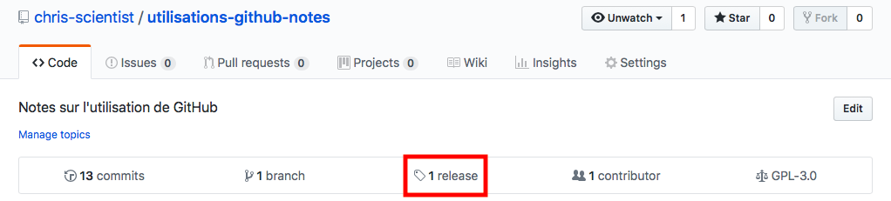
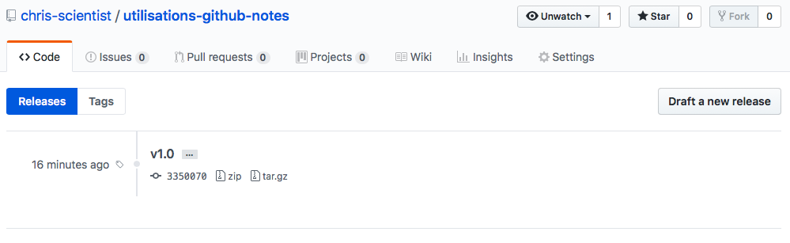
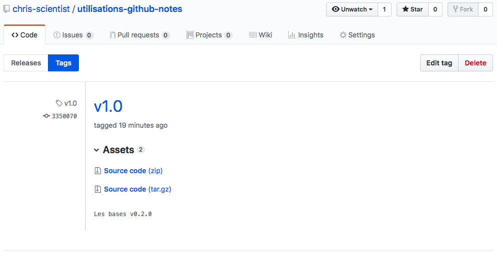

# Les tags - Partagez votre projet sur GitHub

v0.0.1

## Introduction

Avant de vous présenter ce qu'est un tag faisons un petit point ! Ce tutoriel suppose que vous avez les connaissance de bases sur Git et que vous avez un dépôt sur GitHub, dans le cas contraire reportez vous à la [partie 1](part_01.MD). Je présente ici une notion avancée de la gestion des sources.

Qu'est-ce qu'un tag ? Un tag est un instantané de votre projet, par exemple il peut s'agir de la version 1.0 de votre projet. Ce tag vous permet de garder un historique figé de votre projet, en effet c'est une version que vous ne pourrez pas modifier.

## Pratique

### Créer un tag

Imaginons que je souhaite faire un tag, et que je souhaite le nommez "v1.0", la commande pour générique est : `git tag -a nom-tag -m commentaire-entre-double-quote`.

Voici la commande relative à notre exemple :

```
$ git tag -a v1.0 -m "Les bases v0.2.0"
```

### Diffuser le tag

Comme vous l'avez sûrement compris avec le titre, le tag que nous avons créer à l'étape précédente a été créé en local. Si vous souhaitez partager votre tag la commande générique est : `git push origin nom-tag`.

La commande appliquée à notre exemple est la suivante :

```
$ git push origin v1.0
```

Vous pouvez retrouvez les tags partagés d'un projet dans "release" :



Voici l'ensemble des tags qui ont été partagé :



Pour voir les détails d'un tag, comme le montre la capture ci-dessous, cliquez dessus à l'étape précédente :



### Consulter les informations relatives aux tags en local

Vous pouvez, en ligne de commande, récupérer les informations relatives aux tags.

Pour consulter la liste des tags, tapez `git tag`.

Pour consulter les détails d'un tag, la commande générique est : `git show nom-tag`.

Pour reprendre notre exemple, la commande pour avoir les détails est :
```
$ git show v1.0
tag v1.0
Tagger: chris-scientist <votre-adresse-mail>
Date:   Fri Jan 25 19:04:34 2019 +0100

Les bases v0.2.0

commit 33500709ae481594a7d578808a2a14534db30285 (HEAD -> master, tag: v1.0, origin/master, origin/HEAD)
Author: chris-scientist <votre-adresse-mail>
Date:   Thu Jan 24 19:30:36 2019 +0100
```

## Conclusion

Ce court tutoriel s'arrête là. Vous savez maintenant créer, partager et consulter les informations d'un tag.
