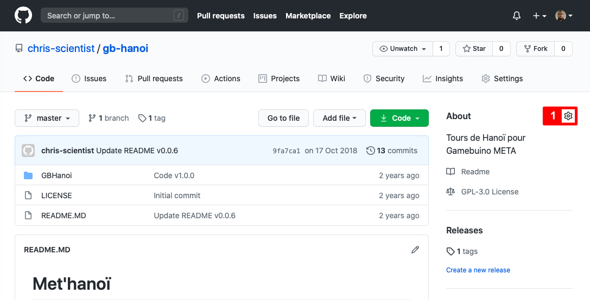
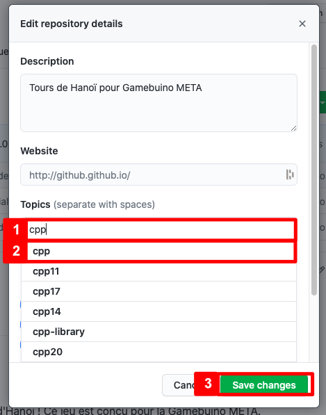

# Les topics - Partagez votre code source sur GitHub

v0.0.1

## Introduction

Nous allons voir maintenant comment référencer son dépôt, ceci à l'aide des **topics** !

Nous illustrons cette partie pour un dépôt relatif à la Gamebuino META ou Classic.

## Pratique

### Ajouter un ou plusieurs topics

1. Rendez-vous sur GitHub, en particulier sur votre dépôt (publique) que vous souhaitez référencer.
2. Cliquez sur la roue (comme le montre la capture ci-dessous)

3. Ajoutez les **topics** (comme le montre la capture ci-dessous) :

* (1) Commencez à saisir le nom d'un *topic*
* (2) Cliquez sur le topic de votre choix.
* (3) Lorsque vous avez ajouté tous les topics souhaités, cliquez sur **Save changes**.

#### Cas spécifique : Gamebuino

Pour un dépôt relatif à la **Gamebuino Classic**, ajoutez les topics :
* *gamebuino*,
* et *gamebuino-classic*.

Pour un dépôt relatif à la **Gamebuino META**, ajoutez les topics :
* *gamebuino*,
* et *gamebuino-meta*.

### Consulter les topics

Rendez-vous sur GitHub, en particulier sur votre dépôt (publique) auquel vous avez déjà ajouté un ou plusieurs topics. Voici un aperçu d'un projet avec quatre topics :

### Rechercher les projets d'un même topics

Pour rechercher les projets, hébergés sur GitHub, ayant les mêmes topics, cliquez sur le topic de votre choix.

## Conclusion

Maintenant vous savez comment référencer votre dépôt sur GitHub.
